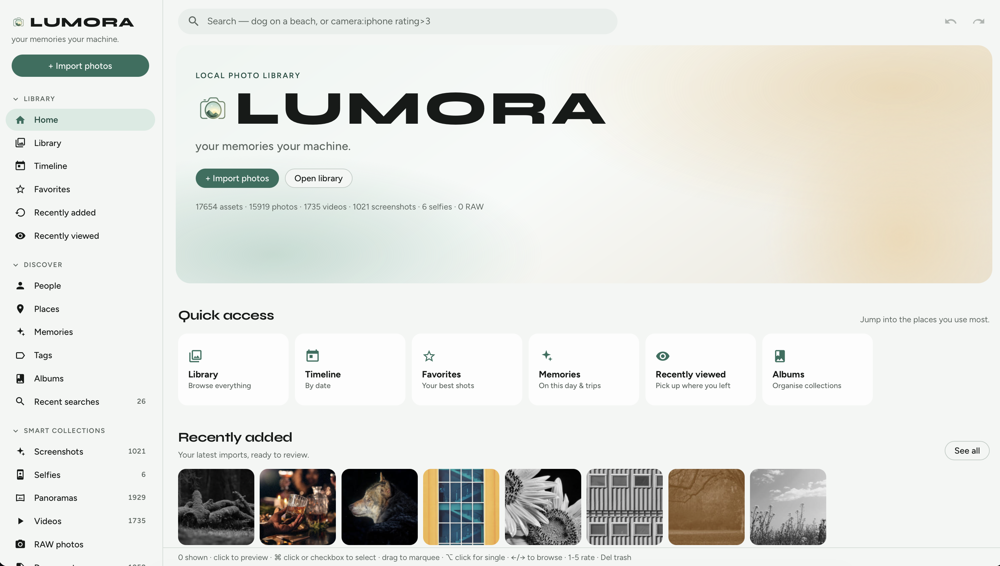
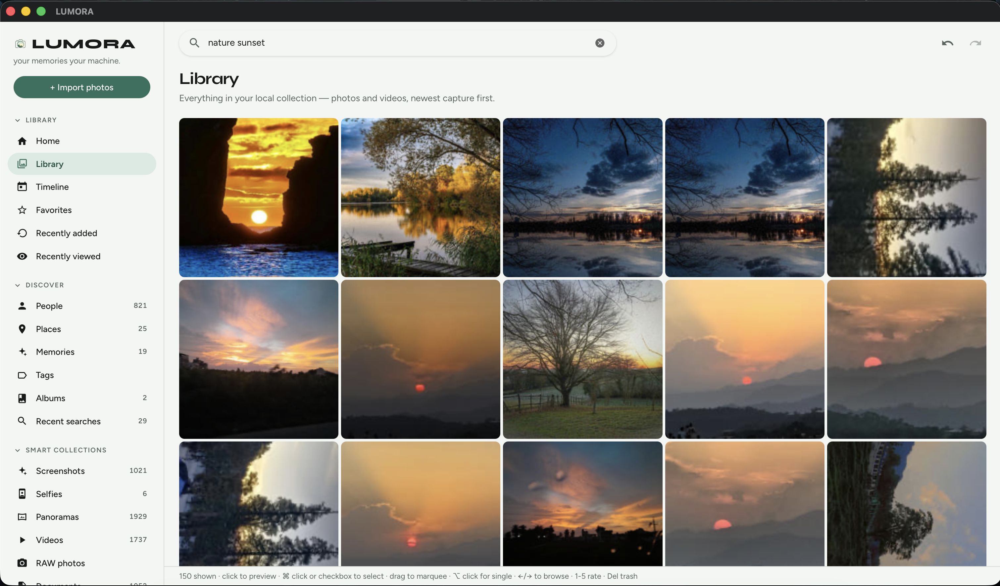
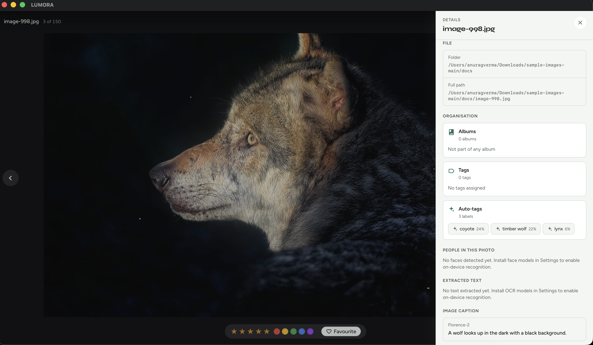
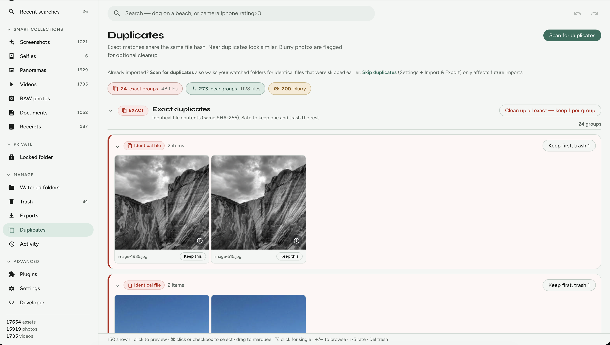
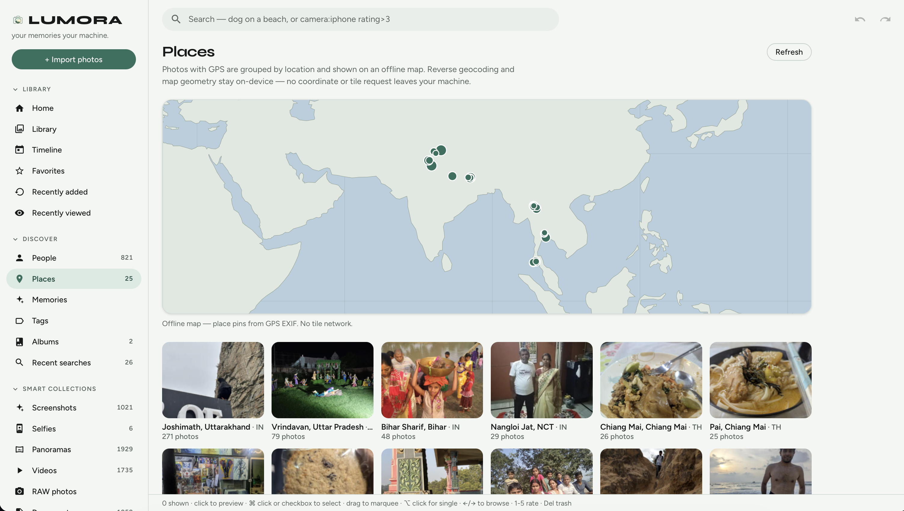
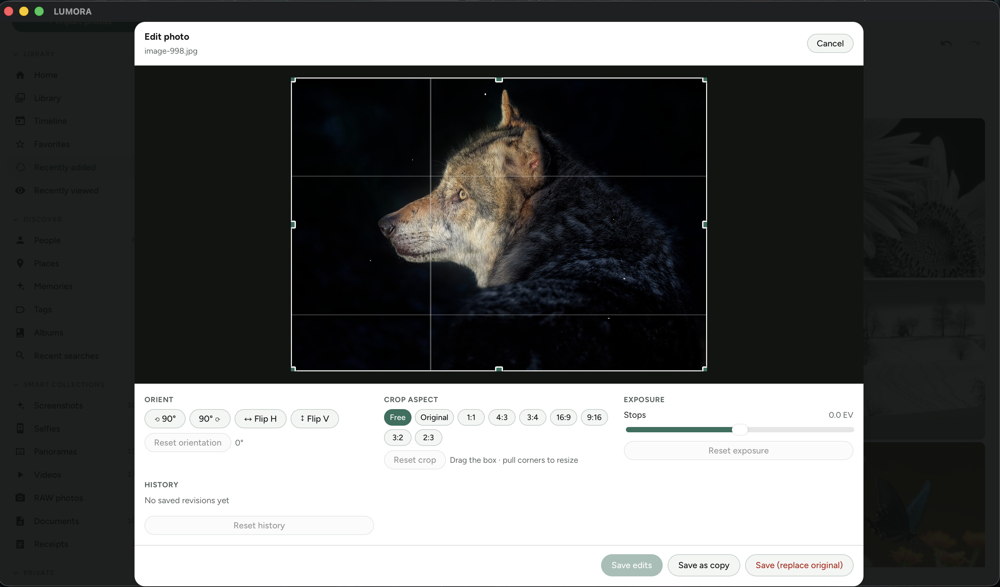
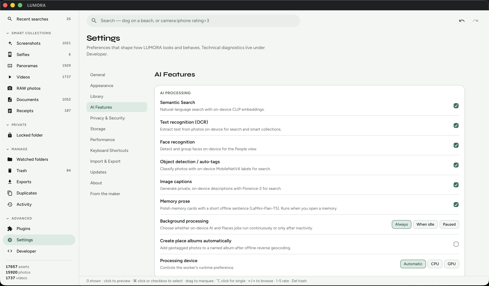
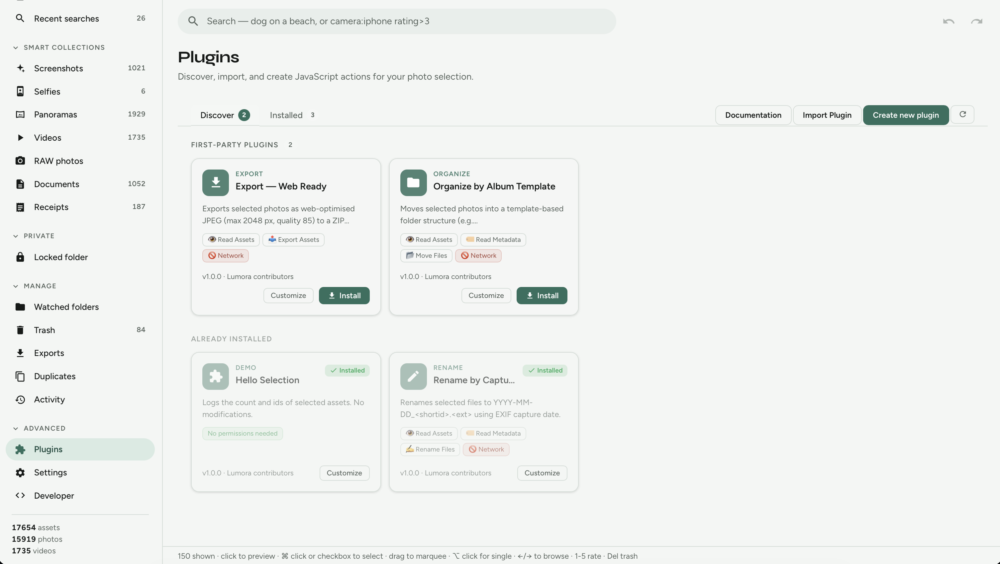

# LUMORA

<p align="center">
  
</p>

<p align="center">
  <strong>Google Photos-style search for your local photo library.<br>Private, AI-powered, and fully offline.</strong>
</p>

<p align="center">
  Open-source Google Photos alternative that runs entirely on your computer.<br>
  Search, organise, and clean up massive photo libraries — without uploading anything to the cloud.
</p>

<p align="center">
  <a href="https://github.com/Anurag-error404/lumora/stargazers"></a>
  <a href="./LICENSE"></a>
  <a href="https://github.com/Anurag-error404/lumora/releases/latest"></a>
  <a href="https://github.com/Anurag-error404/lumora/releases/latest"></a>
  <a href="https://github.com/Anurag-error404/lumora/graphs/contributors"></a>
  <a href="https://github.com/Anurag-error404/lumora/releases"></a>
</p>

<p align="center">
  <a href="https://github.com/Anurag-error404/lumora/releases/latest"><strong>Download Latest Release</strong></a>
  ·
  <a href="https://anurag-error404.github.io/lumora/">Website</a>
  ·
  <a href="https://anurag-error404.github.io/lumora/install.html">Install &amp; Usage</a>
  ·
  <a href="https://anurag-error404.github.io/lumora/guide.html">Documentation</a>
  ·
  <a href="https://github.com/Anurag-error404/lumora/issues/new/choose">Report Bug</a>
  ·
  <a href="https://github.com/Anurag-error404/lumora/discussions">Discussions</a>
</p>

<p align="center">
  
</p>

---

## 📸 What you can do

Search a whole library by meaning, relive curated Memories, and clean up — all on-device.

### Semantic search

Type natural language — CLIP finds matching photos on-device. No cloud, no upload.

<p align="center">
  
</p>

<p align="center">
  
</p>

<p align="center">
  
</p>

Filters like `camera:iphone` and `rating>3` still work for metadata. Auto-tags and on-device captions (Florence-2) make every photo searchable — the info panel shows what the models found.

<p align="center">
  
</p>

### Memories

Stories assembled locally from your dates, people, and places — ranked with on-device CLIP.

### Duplicate & blurry cleanup

Exact matches (SHA-256), near-duplicates, and blurry shots grouped for review — everything soft-trashes with undo.

<p align="center">
  
</p>

### Places (offline map)

GPS-tagged photos grouped by location on an offline map — no coordinate or tile request leaves your machine.

<p align="center">
  
</p>

<details>
<summary><strong>More screens</strong> — Timeline, editing, plugins, AI settings</summary>

**Timeline** — browse by capture date with a year/month scale.


**Edit photo** — rotate, crop, and exposure without touching the original until you save.



**Settings → AI** — toggle Semantic search, OCR, faces, auto-tags, captions; pick CPU/GPU.



**Plugins** — sandboxed JavaScript actions for your selection (no network by default).



</details>

> More assets welcome: drop short GIFs into [`docs/screenshots/`](./docs/screenshots/) (see that folder’s README) to add motion demos.

---

## ⚡ Quick start

### Option A — Download a release (recommended)

1. Open the [latest GitHub Release](https://github.com/Anurag-error404/lumora/releases/latest).
2. Grab the installer for your OS:
   - **macOS (Apple silicon):** `LUMORA_*_aarch64.dmg`
   - **Windows:** `LUMORA_*_x64-setup.exe` or `.msi`
   - **Linux:** `.AppImage`, `.deb`, or `.rpm`
3. Install, launch, then **Home → Import photos** (or drop a folder).

Full walkthrough: **[Install & Usage](https://anurag-error404.github.io/lumora/install.html)** · also [`download.html`](./download.html) · [`guide.html`](./guide.html)

### Option B — Build from source

**Prerequisites:** [Bun](https://bun.sh), [Rust](https://www.rust-lang.org/tools/install) (stable), macOS Xcode CLT if applicable. Optional: `ffmpeg` / `ffprobe`, `jpegtran`.

```bash
bun install
bun run tauri dev      # desktop app + Vite (http://localhost:1420)
bun run tauri build    # release bundle
```

Ensure `~/.cargo/bin` is on your `PATH`.

---

## ✨ Features

### Library & organisation

- Import folders recursively — originals are never moved by indexing
- Watched folders for live add / change / remove
- Photos + videos in one library (video thumbs via system **ffmpeg** when available)
- Full-screen viewer; photo edit; video trim/crop via ffmpeg
- Albums, tags, favourites, ratings, colour labels, timeline, smart collections

### Search

- Full-text (filename, tags, camera, OCR, people, auto-tags, captions)
- Filters: `camera:iphone`, `rating>3`, `before:2024-01-01`
- Natural-language semantic search when CLIP is installed

<details>
<summary><strong>On-device AI (optional)</strong> — install from Settings → AI; app works with zero models</summary>

| Capability | Default backend | Licence notes |
| --- | --- | --- |
| Semantic search | CLIP ViT-B/32 | MIT |
| OCR | PaddleOCR PP-OCRv5 (default) · PP-OCRv6 / RapidOCR v4/v3 | Apache-2.0 |
| Faces / People | InsightFace buffalo_l | Non-commercial research |
| Auto-tags | MobileNetV4 | Apache-2.0 |
| Image captions | Florence-2 Base | MIT |

Switch backends in the model library; import a local ONNX for Auto-tags or Semantic search after a compatibility check. Derived data is clearable without touching originals. See [`docs/THIRD_PARTY.md`](./docs/THIRD_PARTY.md).

</details>

### Cleanup & privacy

- **Exact duplicates** (SHA-256) · **Near duplicates** (aHash) · **Blurry** review
- Soft trash with retention · undo / redo
- **Places** — GPS + offline reverse geocode (no tile network)
- **Locked folder** — encrypted vault with recovery code

---

## 🏆 Lumora vs alternatives

| Feature | Lumora | Google Photos | Immich |
| --- | :---: | :---: | :---: |
| Local-first desktop app (no server) | ✅ | ❌ | ❌ |
| Works fully offline after install | ✅ | ❌ | ⚠️ server must be up |
| Open source | ✅ | ❌ | ✅ |
| Cloud account required | ❌ | ✅ | ❌ |
| Semantic search | ✅ | ✅ | ✅ |
| Face recognition | ✅ | ✅ | ✅ |
| Encrypted private vault | ✅ | ❌ | ❌ |

Immich is excellent self-hosted software — it still needs a always-on server. Lumora is a **desktop app**: point it at folders on disk and stay offline.

---

## 🚀 Performance & scale

Measured on an Apple M3 Pro (18 GB) — details in [`docs/perf-smoke.md`](./docs/perf-smoke.md):

| Claim | Evidence |
| --- | --- |
| Sub-millisecond FTS search (warm) | **0.14 ms** avg (`Canon` / `camera:` filters, 100-item synthetic set) |
| Idle memory (debug / `tauri dev`) | **~112 MB** RSS |
| Thumbnail throughput (debug) | **~878 images/min** sequential |
| Real library import exercised | **272** media files (batched SQLite + workers) |

Architecture targets (not yet claimed at million scale): cold start &lt; 2 s, warm FTS &lt; 100 ms, idle RAM &lt; 250 MB, stable browse toward large libraries via virtualised grid + incremental indexing + SQLite FTS5.

```bash
cargo test --manifest-path src-tauri/Cargo.toml perf_smoke -- --ignored --nocapture
```

---

## 📖 Why I built Lumora

I wanted Google Photos convenience without the deal: upload everything, hope the cloud stays friendly, and accept that search and face grouping only work if Google has a copy of your life.

Self-hosted options help, but they still mean running a server, keeping disks healthy, and teaching family members a URL. Most of my library already lives on a laptop SSD. I wanted an app that indexes **where the files already are**, runs optional AI **on the same machine**, and never phones home.

Lumora is that bet: local-first by default, MIT-licensed, and useful with zero models — with CLIP, OCR, faces, and a vault when you want them. Privacy isn’t a toggle; it’s the product.

---

## 🌐 Community

- [Discussions](https://github.com/Anurag-error404/lumora/discussions) — questions & ideas
- [Issues](https://github.com/Anurag-error404/lumora/issues) — bugs & feature requests
- [Contributing](./CONTRIBUTING.md) — PRs welcome (no telemetry, no cloud inference for library content)
- [Ko-fi](https://ko-fi.com/anuragerror404) — optional support; never unlocks features or weakens privacy

---

## 🛠 Development

```bash
bun run typecheck          # TypeScript
bun test                   # frontend tests
cd src-tauri && cargo test # Rust unit tests
```

### Project layout

```
src/                 React + TypeScript UI
src-tauri/           Rust backend (indexer, ML workers, vault, SQLite)
docs/                ADRs, perf notes, third-party licences, screenshot assets
index.html           Product landing
install.html         Install & usage landing
download.html        Release download helper
guide.html           Full end-user guide
app.html             Tauri webview entry
```

### Documentation map

| Doc | Audience |
| --- | --- |
| [install.html](./install.html) | Install + first-run usage |
| [guide.html](./guide.html) | Full end-user guide |
| [CONTRIBUTING.md](./CONTRIBUTING.md) | Contributors |
| [docs/README.md](./docs/README.md) | Docs index |
| [docs/adr/](./docs/adr/) | Architecture decisions |
| [docs/perf-smoke.md](./docs/perf-smoke.md) | Performance checklist |
| [docs/THIRD_PARTY.md](./docs/THIRD_PARTY.md) | Optional model / data licences |

---

## 🔒 Privacy

- Core features work with **no network**
- Model downloads are **user-initiated** and SHA-256 verified
- Optional in-app updates check GitHub Releases when enabled
- Logs and import analytics stay in local app data — never uploaded
- No analytics, crash upload, or cloud photo APIs

---

## ⌨️ Keyboard shortcuts

| Key | Action |
| --- | --- |
| Click | Open media viewer |
| Space | Toggle / close viewer |
| ← / → | Previous / next |
| F | Favourite |
| 0–5 | Rate |
| ⌘A / Ctrl+A | Select all visible |
| Delete | Soft-delete (restore from Trash) |
| ⌘Z / Ctrl+Z | Undo |
| Esc | Close viewer / clear selection |

More: [guide → Shortcuts](./guide.html#shortcuts).

---

## 📄 License

[MIT](./LICENSE) © 2026 Anurag Verma.

Optional AI models you download later keep their **upstream** licences (shown in Settings → AI). InsightFace face packs are typically **non-commercial research** only — see [`docs/THIRD_PARTY.md`](./docs/THIRD_PARTY.md).
