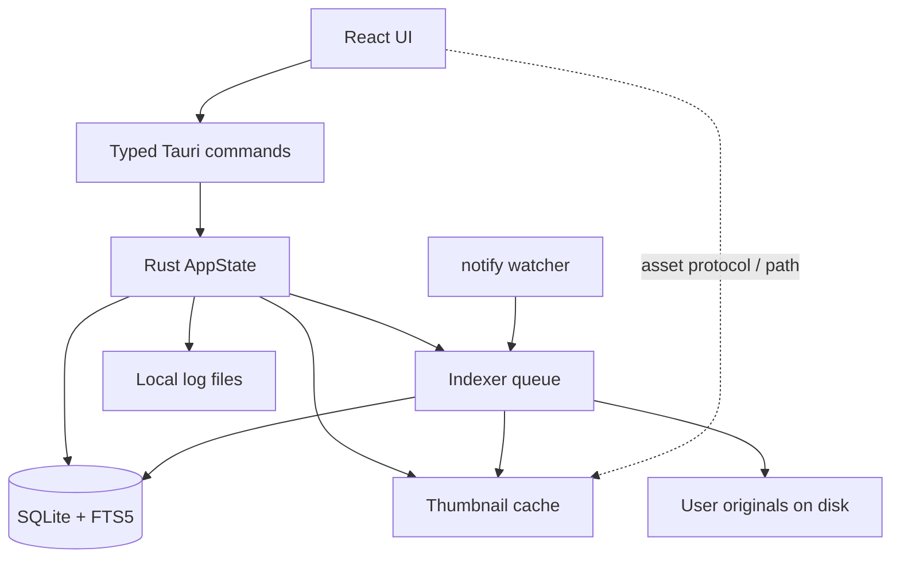
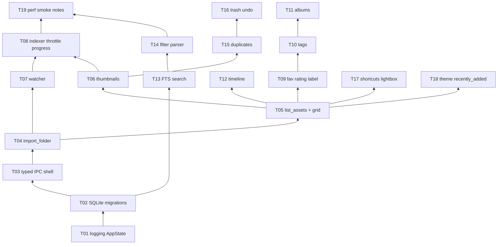

# Implementation Plan: PhotoVault AI (MVP / Phase 1)

## Overview

Deliver a local-first Tauri v2 + React/TS + Rust photo/video library for **archive/pro organisers**: import and watch folders (originals untouched), virtualised browse + timeline, albums/tags/ratings/labels/favourites, FTS + metadata filters, duplicates, trash/undo, and **local-only** logs. No ML, vault, map, or editing in this plan.

Scaffold already exists ([`src-tauri/src/lib.rs`](Open-source/Master-Photo-Manager/src-tauri/src/lib.rs), [`src/App.tsx`](Open-source/Master-Photo-Manager/src/App.tsx)). Replace the `greet` demo with domain modules per [`SPEC.md`](Open-source/Master-Photo-Manager/SPEC.md).

This file is the approved implementation plan. Track progress in `tasks/todo.md`.

## Locked decisions (SPEC open questions)

| Topic          | Decision                                                                                                                        |
| -------------- | ------------------------------------------------------------------------------------------------------------------------------- |
| EXIF           | **`kamadak-exif`** (pure Rust) for reads in MVP; EXIF write deferred                                                            |
| Thumbnails     | JPEG, **max 320px** long edge, `app_data/thumbs/{sha256}.jpg`; **no eviction** in MVP (document growth; eviction later)         |
| Video          | Index in same library; **placeholder thumbnail** + duration/container metadata; frame extract deferred (avoids bundling ffmpeg) |
| Min OS         | macOS 13+, Windows 10+, recent glibc Linux                                                                                      |
| Editing        | **Deferred to v1.5**                                                                                                            |
| Product name   | Keep **PhotoVault AI**                                                                                                          |
| Saved searches | **Out of MVP** (Phase 1.1)                                                                                                      |

Ask before adding any crate beyond what each task lists (per SPEC boundaries).

## Architecture

**Indexer pipeline (per file):** discover → SHA256 → EXIF/dims (images) or container meta (video) → insert/update row → enqueue thumbnail → update FTS.

## Dependency graph (implementation order)

## Phases and tasks

### Phase 0 — Foundation

**T01 — Local logging + AppState paths**  
Wire `tracing` (or `log` + file appender) to app-data `logs/`; create `AppState` with `app_data`, `db_path`, `thumbs_dir`, `logs_dir`. No network.

- Acceptance: logs written under app data on startup; paths resolvable in tests.
- Verify: `cd src-tauri && cargo test logging` + manual open app, confirm log file.
- Files: `src-tauri/src/logging/`, `src-tauri/src/state.rs`, `lib.rs`
- Scope: M

**T02 — SQLite + migrations (MVP schema)**  
`rusqlite` + versioned SQL migrations: `assets`, `albums`, `album_assets`, `tags`, `asset_tags`, `trash` fields / `deleted_at`, FTS5 virtual table stub.

- Acceptance: fresh DB migrates; reopen applies none; schema matches SPEC data model (no faces/embeddings).
- Verify: `cargo test db_migrations`
- Files: `src-tauri/migrations/`, `src-tauri/src/db/`
- Scope: M

**T03 — Typed IPC shell + strip demo UI**  
Replace `greet` with health/`get_library_stats` stub; add [`src/lib/tauri/`](Open-source/Master-Photo-Manager/src/lib/tauri/) wrappers; shell layout (sidebar + main). System theme CSS variables.

- Acceptance: `bun run typecheck`; app launches with empty library shell; no raw `invoke` strings in features.
- Verify: `bun run typecheck` + `bun run tauri dev` smoke
- Files: `lib.rs`, `src/lib/tauri/`, `src/App.tsx`, `src/styles/`
- Scope: M

### Checkpoint A — Foundation

- [ ] `cargo test` + `bun run typecheck` pass
- [ ] App opens, logs to disk, empty DB created
- [ ] Human review before import work

### Phase 1 — Import → browse (first vertical slice)

**T04 — Import folder (scan + hash + insert)**  
`import_folder(path)` recursive scan; photo + video extensions; SHA256; image dims via `image` crate; video rows with placeholder thumb path null; preserve originals.

- Acceptance: importing a fixture folder yields correct asset counts; re-import is incremental (same hash/path upsert).
- Verify: Rust integration test with temp dir fixtures
- Files: `src-tauri/src/indexer/`, `commands/import.rs`
- Scope: M

**T05 — list_assets + virtualised grid**  
Paginated `list_assets`; React virtualised grid (windowing); Import Folder button (dialog plugin).

- Acceptance: imported fixtures appear; scrolling stays smooth on 10k synthetic rows (mock or seeded).
- Verify: manual import + scroll; `bun run typecheck`
- Files: `commands/assets.rs`, `src/features/library/`, `src/lib/tauri/assets.ts`
- Scope: M

**T06 — Thumbnail generation + grid display**  
Background job: decode image → 320px JPEG → `thumbs/{sha256}.jpg`; expose path/asset protocol for UI; videos show placeholder.

- Acceptance: image thumbs render; missing thumb does not block listing; ≥100 img/min on local SSD fixture (measure in notes).
- Verify: cargo unit test for resize; manual grid check
- Files: `src-tauri/src/thumbnails/`, grid component
- Scope: M

### Checkpoint B — Can import and browse

- [ ] End-to-end: pick folder → assets in DB → thumbs → grid
- [ ] Originals unmodified on disk
- [ ] Human review

### Phase 2 — Watch + indexer control

**T07 — Folder watcher**  
Persist watched roots; `notify` → enqueue path events (create/modify/remove).

- Acceptance: add/delete file in watched folder updates library without full rescan.
- Verify: integration test or manual watch smoke
- Files: `src-tauri/src/watcher/`, `db` watched_folders table if needed
- Scope: M

**T08 — Indexer queue, throttle, progress events**  
Single worker queue; yield/throttle under load; emit progress to UI (`indexing` status).

- Acceptance: UI shows progress; interactive scroll remains usable while indexing.
- Verify: manual large-folder import smoke
- Files: `indexer/queue.rs`, UI status bar
- Scope: M

### Checkpoint C — Live library

- [ ] Watch + throttle behave; no telemetry
- [ ] Human review

### Phase 3 — Organisation

**T09 — Favourite, rating (1–5), colour label**  
Commands + selection actions in grid/detail.

- Acceptance: values persist across restart; filterable later via T14.
- Verify: cargo + manual
- Files: `commands/metadata.rs`, `features/library/`
- Scope: S–M

**T10 — Tags**  
Create/assign/remove tags; FTS document update hook.

- Acceptance: tag round-trip; asset shows tags.
- Verify: tests + manual
- Files: `db/tags.rs`, `features/tags/`
- Scope: M

**T11 — Albums**  
CRUD albums; add/remove assets; simple drag-drop onto album.

- Acceptance: album membership persists; cover optional.
- Verify: manual + tests
- Files: `commands/albums.rs`, `features/albums/`
- Scope: M

**T12 — Timeline (year/month)**  
Query assets grouped by `captured_at`/`created_at`; timeline nav UI.

- Acceptance: navigate Jul 2026-style groups; empty months omitted.
- Verify: manual with dated fixtures
- Files: `commands/timeline.rs`, `features/timeline/`
- Scope: M

### Checkpoint D — Organised library

- [ ] Albums/tags/ratings/timeline work on imported set
- [ ] Human review

### Phase 4 — Search

**T13 — FTS5 text search**  
Index filename, tags, key metadata; `search_assets(query)` &lt;100ms goal on warm DB.

- Acceptance: search returns expected fixtures; empty query = browse.
- Verify: cargo tests with seeded DB
- Files: `src-tauri/src/search/`, `features/search/`
- Scope: M

**T14 — Filter parser**  
Parse `camera:`, `rating>`, `before:`, `after:`, `type:video|image` into SQL.

- Acceptance: unit tests for parser; combined text+filter works.
- Verify: `bun test` parser + `cargo test` filters
- Files: `search/filters.rs`, `src/features/search/parse-filters.ts`
- Scope: M

### Checkpoint E — Find anything

- [ ] Locate asset via search/filters within ~10s on warm index
- [ ] Human review

### Phase 5 — Duplicates + trash

**T15 — Exact + near duplicates**  
Group by SHA256; near-dup via perceptual hash (`img_hash` or equivalent) for images.

- Acceptance: exact pairs found; near-dup finds recompressed fixture; UI lists groups.
- Verify: fixture tests
- Files: `src-tauri/src/duplicates/`, `features/duplicates/`
- Scope: M

**T16 — Trash, restore, 30-day purge, undo**  
Soft-delete; restore; purge job; undo last destructive op where feasible. Originals: **trash = hide in library first**; physical delete only via explicit purge confirmation (ask if changing).

- Acceptance: delete → trash → restore; purge after retention configurable default 30d.
- Verify: cargo + manual
- Files: `src-tauri/src/trash/`, UI trash view
- Scope: M

### Checkpoint F — Safe cleanup

- [ ] Duplicate cleanup uses trash; undo/restore verified
- [ ] Human review

### Phase 6 — QoL + acceptance

**T17 — Keyboard shortcuts + lightbox**  
Space preview, arrows, delete, favourite, fullscreen.

- Acceptance: shortcuts documented in README; work in grid/lightbox.
- Verify: manual
- Files: `features/viewer/`, shortcut hook
- Scope: M

**T18 — Theme + Recently added**  
**Light theme only** (no system/dark switching in Phase 1); Recently added view. Recently viewed added later (see SPEC).

- Acceptance: single light appearance; recent list correct.
- Verify: manual
- Files: `styles/`, `features/library/recent.tsx`
- Scope: S

**T19 — Perf smoke checklist + docs ADR**  
Document how to measure cold start, search latency, idle RAM, 1M-scale strategy (synthetic seed script outline); ADR for EXIF/thumbs/video decisions.

- Acceptance: checklist in `docs/`; no claim of 1M pass without measured run; fill recorded-run row when smoke is executed.
- Verify: `cargo test perf_smoke -- --ignored --nocapture`; record numbers in `docs/perf-smoke.md`
- Files: `docs/perf-smoke.md`, `docs/adr/`
- Scope: S–M

### Checkpoint G — MVP complete

- [ ] SPEC MVP checklist items (minus deferred editing/saved search) done
- [ ] Zero network for core flows; logs local only
- [ ] Ready for Phase 2 planning (ML)

## Parallelization (after contracts exist)

- After T03: frontend shell polish vs T02 tests (limited)
- After T05: T09–T12 UI can parallel with T07–T08 backend if IPC types frozen
- After T13: T14 parser TS/Rust unit tests parallel
- Never parallel conflicting migrations

## Risks and mitigations

| Risk                         | Impact | Mitigation                                     |
| ---------------------------- | ------ | ---------------------------------------------- |
| 1M-scale UI jank             | High   | Virtualise early (T05); paginate all list APIs |
| Indexer starves UI           | High   | Dedicated queue + throttle (T08)               |
| Thumbnail disk growth        | Med    | 320px JPEG; document; eviction later           |
| Video without ffmpeg         | Med    | Placeholder thumbs; metadata-only until later  |
| Schema churn                 | Med    | Migrations only; ask before changes            |
| Accidental original deletion | High   | Soft-delete default; explicit purge confirm    |

## Out of scope (do not schedule)

ML/ONNX, vault, map, smart AI albums, plugins, sync, mobile, basic raster editing, saved searches, telemetry.

## Verification gate (plan)

- [x] Tasks have acceptance + verification
- [x] Dependencies ordered; checkpoints every phase
- [x] Tasks sized ≤ ~5 files (M)
- [x] Human approved this plan; `tasks/plan.md` + `tasks/todo.md` written
- [x] Implementation in progress per task list
